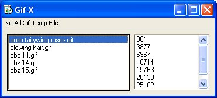



## Gif\-X Animation Viewer

### Description

View Gif Animation w/o any ocx at all. Prove that you could view gif frames by extracing the hex. The code could be used to view or extract frame by frame. Over 225 view and possible downloads with no votes at all. Not very encouraging to submit further projects and updates.
 
### More Info
 
Gif Files

There is lots more work to do with them to make it a full gif decoder... but I did it with hexworkshop and vb. no knowledge of gifs beforehand. I think it's a good start to something that has been so mystifying to vb programmers for years that have used gif98a.ocx in the past.

View of animation in file.

some files will crash the app as it's not perfect and some glitches may occur. I've not added any support yet for frame header reading or header generation for extracted frames. The extracted frames won't open as gifs but will open in paint since paint doesn't read the image header.

             |
---                |---
**Submitted On**   |2003-12-06 00:21:36
**By**             |[Lord Kuraria](https://github.com/Planet-Source-Code/PSCIndex/blob/master/ByAuthor/lord-kuraria.md)
**Level**          |Beginner
**User Rating**    |4.0 (16 globes from 4 users)
**Compatibility**  |VB 6\.0
**Category**       |[Graphics](https://github.com/Planet-Source-Code/PSCIndex/blob/master/ByCategory/graphics__1-46.md)
**World**          |[Visual Basic](https://github.com/Planet-Source-Code/PSCIndex/blob/master/ByWorld/visual-basic.md)
**Archive File**   |[Gif\-X\_Anim1681141262003\.zip](https://github.com/Planet-Source-Code/lord-kuraria-gif-x-animation-viewer__1-50355/archive/master.zip)

